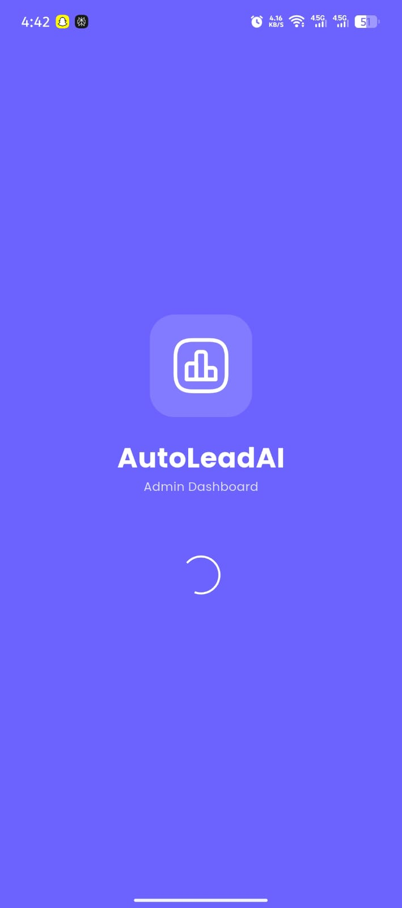
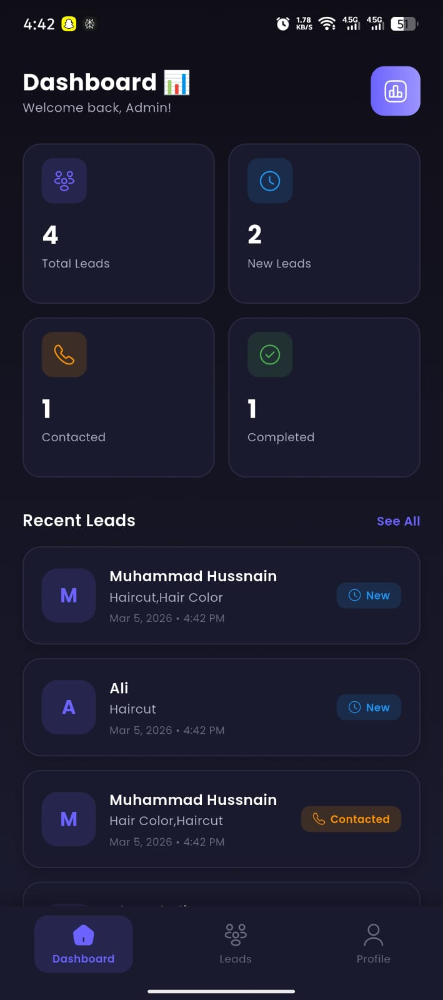
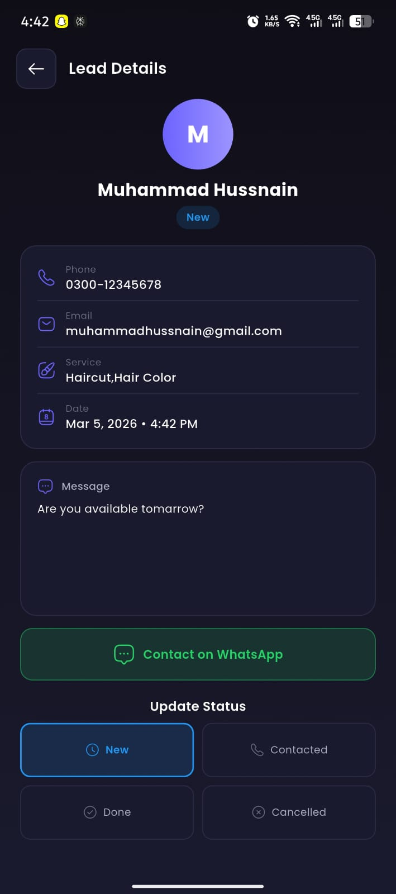
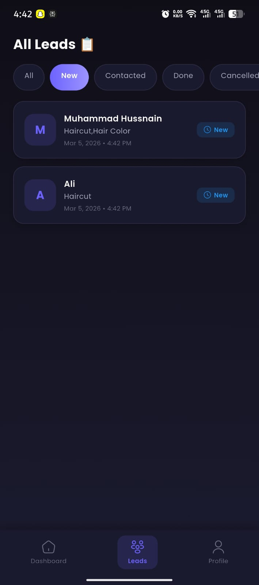
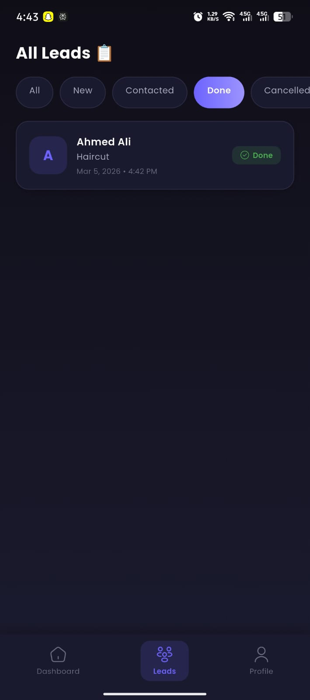
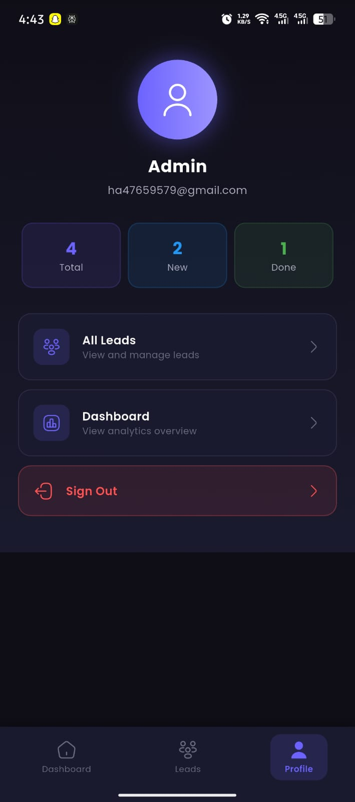
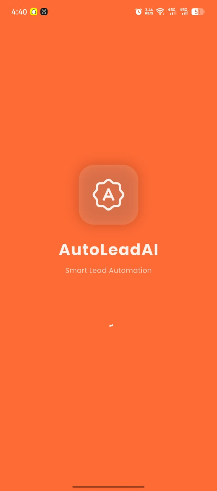
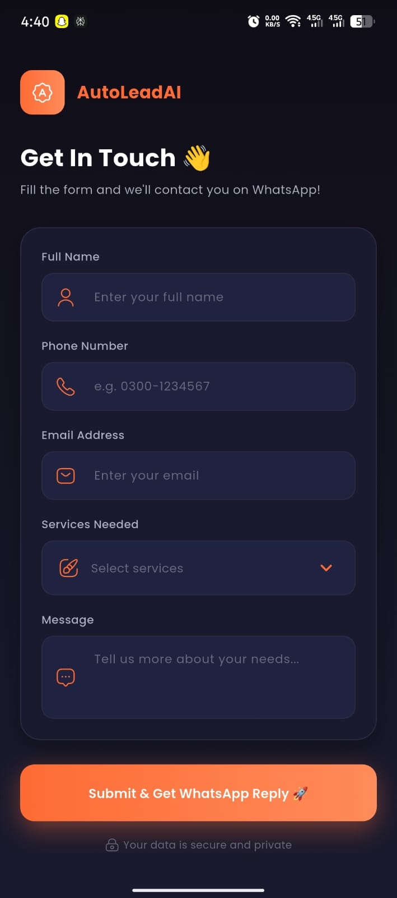
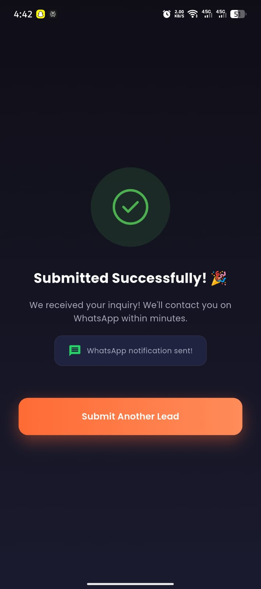

# 🤖 AutoLead

### Flutter + n8n Salon Booking & Lead Automation System

---

## 🚨 The Problem

A salon owner was managing bookings through **WhatsApp messages, phone calls, and paper registers.**

- ❌ Appointments were being double-booked
- ❌ Staff spent hours manually entering customer data
- ❌ No-shows had no follow-up system
- ❌ Owner had no real-time view of daily bookings
- ❌ Leads were lost because nobody responded fast enough

**The business was losing money every day — not because of no customers, but because of no system.**

---

## ✅ The Solution

A complete **Flutter app + n8n automation system** that handles the entire booking journey from customer tap to owner action with zero manual work.

---

## ⚡ How The Full System Works

**Step 1** 👤 Customer opens the app

**Step 2** 📋 Fills in: Name, Phone, Email, Service, Message

**Step 3** 📤 Flutter sends data to n8n webhook

**Step 4** ⚙️ n8n automation fires instantly:

- ✉️ Confirmation email sent to customer
- 📊 Data saved to Google Sheets
- 🔥 Data synced to Firebase Firestore

**Step 5** 📱 Admin panel updates in real-time

**Step 6** 👨‍💼 Owner sees booking and contacts customer on WhatsApp in 1 tap

---

## 📱 App Structure

### 👤 User App — `/user-app`

| Screen | What It Does |
|---|---|
| 🏠 Home | Welcome screen with services overview |
| 📋 Booking Form | Customer fills name, phone, email, service, message |
| ✅ Confirmation | Success screen after booking submitted |

### 🖥️ Admin Panel — `/admin-app`

| Screen | What It Does |
|---|---|
| 🔐 Login | Secure admin authentication |
| 📊 Dashboard | Real-time stats — today's bookings, total leads |
| 📋 Leads Screen | All bookings with name, service, status |
| 👤 Detail Screen | Full customer info + WhatsApp 1-tap contact |
| ⚙️ Profile | Admin profile management |

### ⚙️ n8n Workflow — `/n8n-workflow`

| Node | Action |
|---|---|
| 🎣 Webhook | Receives booking data from Flutter |
| ✉️ Gmail Node | Sends auto confirmation email |
| 📊 Google Sheets | Appends booking to master sheet |
| 🔥 Firebase Node | Saves data to Firestore |
| 📤 Respond Node | Returns success to Flutter app |

---

## 🛠️ Tech Stack

| Layer | Technology |
|---|---|
| 📱 Mobile App | Flutter + Dart |
| 🎨 State Management | Riverpod |
| 🧭 Navigation | GoRouter |
| 🔥 Database | Firebase Firestore |
| ⚙️ Automation | n8n |
| 📊 Data Backup | Google Sheets |
| 📧 Email | Gmail via n8n |
| 💬 Contact | WhatsApp API |

---
---

## 📊 Real Results This System Delivers
### ✅ After AutoLead

- Bookings happen 24/7 — no staff involvement needed at all
- Zero manual data entry — everything automatic from day one
- Customer gets confirmation email within 3 seconds of booking
- Owner sees every single lead in real-time from one dashboard
- Lead response time dropped from 3–4 hours to under 10 seconds
- No more double bookings — Firebase prevents all conflicts
- Google Sheets gives permanent backup of every lead ever received
- WhatsApp contact in 1 tap directly from the admin panel

---
## 📸 Screenshots

### 🖥️ Admin Panel

  
  
  
  
  

  

### 👤 User App

  
  &nbsp;&nbsp;
  
  &nbsp;&nbsp;
  

